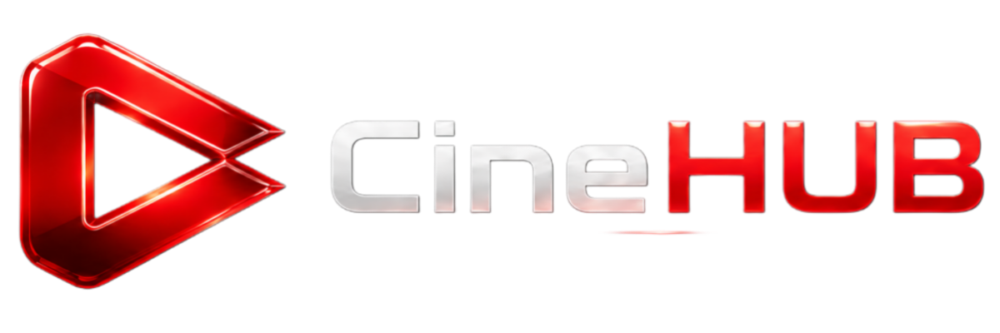
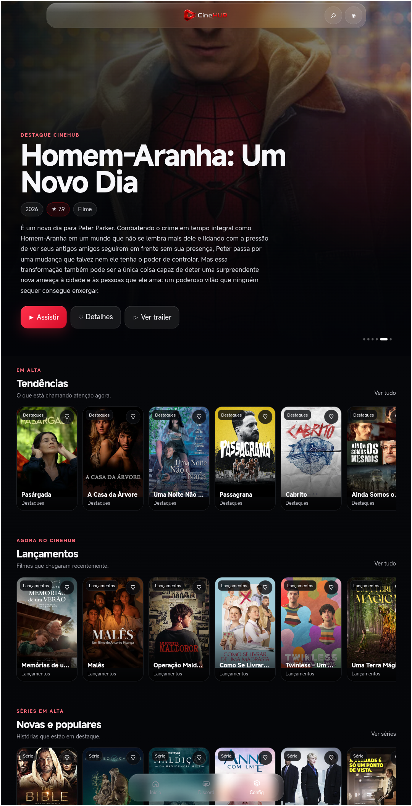
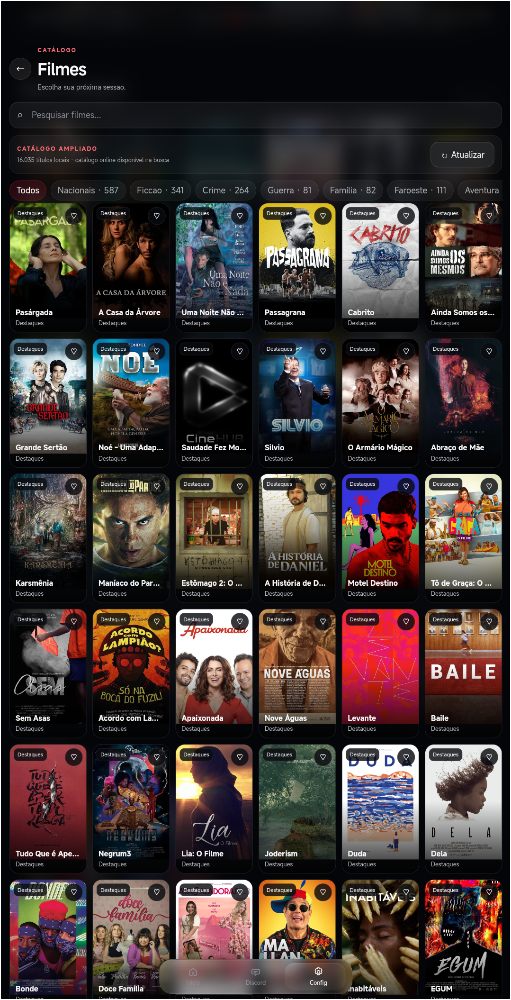
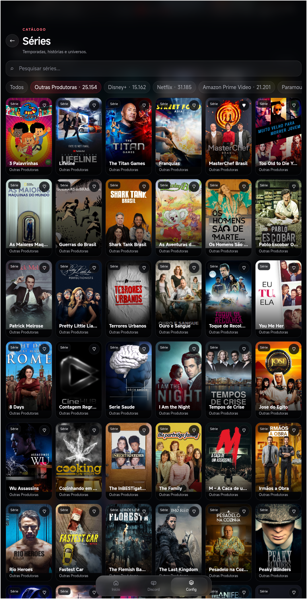
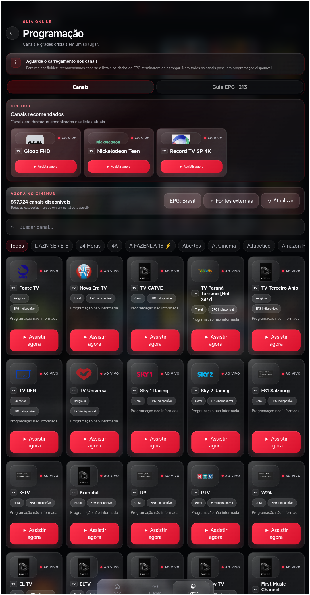
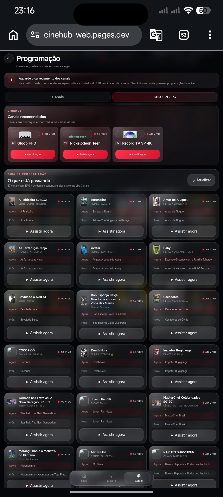
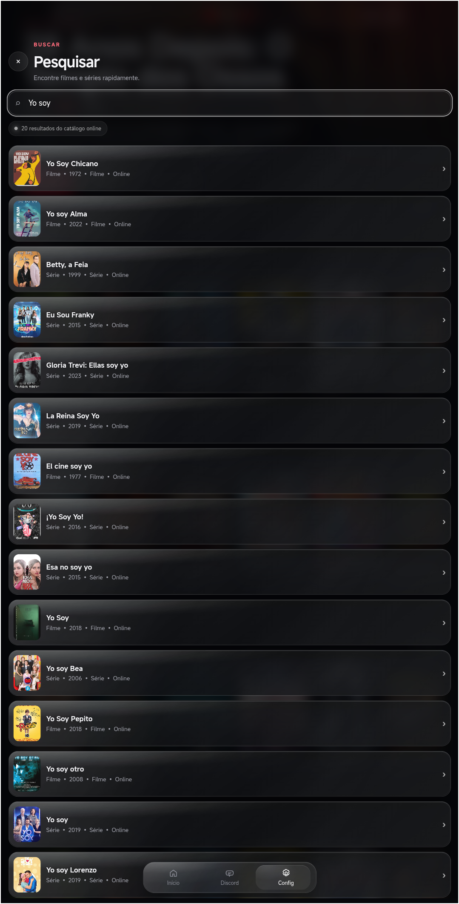
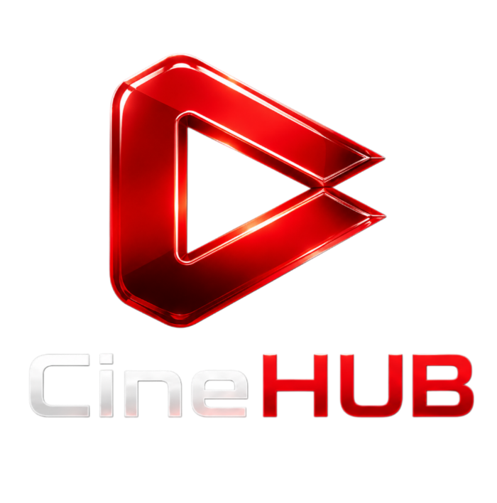
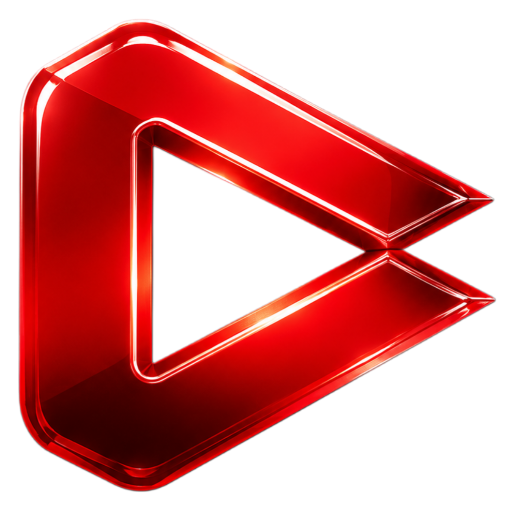
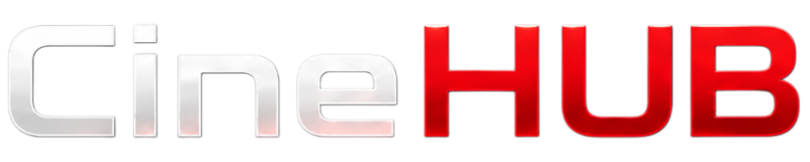

# 🎬 CineHUB

<p align="center"></p>
<p align="center"><strong>Entretenimento sem limites.</strong><br>Uma experiência de entretenimento construída para WEB, Mobile e TV.</p>

<p align="center"><a href="https://github.com/mooNXy7/CineHUB"></a> <a href="#-plataformas"></a> <a href="#-plataformas"></a> <a href="#-plataformas"></a></p>

---

## 🍿 Sobre o CineHUB

O **CineHUB** é um projeto independente de software e entretenimento digital criado para reunir, em uma experiência única, **filmes, séries, canais, programação e conteúdo online**.

Mais do que uma interface de streaming, o CineHUB nasceu com uma ideia simples:

> **Criar uma central de entretenimento própria, bonita, rápida e acessível — sem perder a liberdade de evoluir.**

O projeto começou de forma simples, desenvolvido no Android com ferramentas como **Acode e Termux**, e foi crescendo até se transformar em uma arquitetura multiplataforma com **CineHUB WEB, CineHUB Mobile e CineHUB TV**, distribuição automatizada, atualização OTA e infraestrutura em nuvem.

Hoje, este repositório é a casa técnica e visual do projeto.

## 🎯 Nossa visão

- **🎨 Identidade própria** — não queremos simplesmente copiar a aparência de outras plataformas.
- **⚡ Performance** — beleza não deve significar lentidão.
- **🧱 Estabilidade primeiro** — uma base estável vem antes de novas funções.
- **🔄 Evolução contínua** — o projeto deve poder crescer sem precisar ser reconstruído a cada mudança.
- **📱 Multiplataforma** — WEB, Mobile e TV fazem parte do mesmo ecossistema.
- **🧩 Modularidade** — código, conteúdo, configuração e distribuição devem evoluir de forma organizada.
- **🆓 Acesso** — o CineHUB é desenvolvido como um projeto gratuito e independente.
- **🚀 Experimentação** — novas ideias fazem parte do projeto, mas devem entrar de maneira responsável.
- **❤️ Experiência do usuário** — tecnologia existe para servir a experiência, não o contrário.

### Nossa regra principal

> **Evoluir sem quebrar o que já funciona.**

---

## ✨ A experiência CineHUB

<p align="center"></p>

<p align="center"> &nbsp;  &nbsp; </p>

<p align="center"> &nbsp; </p>

---

## 📦 Plataformas

O CineHUB possui três frentes principais. Elas fazem parte do mesmo ecossistema, mas cada uma possui necessidades próprias.

### 🌐 CineHUB WEB

A experiência oficial para navegadores, hospedada na infraestrutura web do projeto e pensada para oferecer a experiência completa diretamente no navegador.

📁 `CineHUB_WEB/`

**Foco:** interface, catálogo, descoberta, canais, programação, player e experiência web.

### 📱 CineHUB Mobile

Aplicativo Android para dispositivos móveis. O Mobile utiliza uma camada Android própria integrada à experiência CineHUB e possui mecanismo de **atualização OTA**, permitindo distribuir novas versões do aplicativo de forma automatizada.

📁 `CineHUB_Mobile_Android/`

**Foco:** experiência móvel, integração Android, desempenho, reprodução e atualizações.

### 📺 CineHUB TV

Aplicativo desenvolvido especificamente para **Android TV** e dispositivos controlados por D-pad/controle remoto. A experiência TV possui navegação e componentes próprios para televisão, incluindo player e controles adaptados ao ambiente de sala.

📁 `CineHUB_TV_Android/`

**Foco:** controle remoto, D-pad, player TV, navegação à distância, tela grande e estabilidade.

---

## ⚙️ Ecossistema técnico

```text
                         ┌──────────────────┐
                         │     GitHub       │
                         │ código + versões │
                         └────────┬─────────┘
                                  │
                           GitHub Actions
                                  │
                    ┌─────────────┴─────────────┐
                    │                           │
              ┌─────▼─────┐               ┌────▼────┐
              │ Cloudflare │               │ Releases│
              │    WEB     │               │  OTA    │
              └─────┬─────┘               └────┬─────┘
                    │                            │
             ┌──────┴──────┐              ┌─────┴─────┐
             │             │              │           │
           🌐 WEB       📱 Mobile       📱 APK      📺 APK
             │             │              │           │
             └─────────────┴──────────────┴───────────┘
                            CineHUB
```

---

## 🎬 Recursos

- 🎞️ Filmes
- 📺 Séries e episódios
- 📡 Canais
- 🗓️ Guia eletrônico de programação (EPG)
- 🔎 Pesquisa
- ❤️ Favoritos
- ▶️ Player integrado
- ⏯️ Continuação de reprodução
- 📱 Experiência mobile
- 📺 Navegação otimizada para Android TV
- 🔄 Atualizações OTA
- ⚡ Carregamento e reprodução progressivos
- 🎨 Interface inspirada em Liquid Glass

---

## 🎨 Identidade visual

A identidade CineHUB combina **cinema + tecnologia + profundidade + vidro + simplicidade**.

| Elemento | Direção |
|---|---|
| 🔴 Vermelho CineHUB | energia, destaque e identidade |
| ⚫ Preto | cinema, profundidade e imersão |
| ⚪ Branco | contraste, leitura e clareza |
| 🪟 Glass / blur | profundidade e sensação de interface moderna |

O vermelho é usado como **assinatura**, não como preenchimento excessivo.

A interface deve transmitir uma sensação **premium, moderna e cinematográfica**, mas sem exagerar nos efeitos.

### Linguagem visual

- superfícies suaves;
- cantos e elementos menos rígidos;
- transparência e blur quando fazem sentido;
- brilho vermelho discreto;
- hierarquia visual clara;
- animações rápidas e naturais;
- foco no conteúdo;
- adaptação para telas pequenas e grandes.

> **Liquid Glass é uma linguagem visual — não uma desculpa para colocar blur em tudo.**

## 🖼️ Marca

<p align="center"></p>
<p align="center"> &nbsp;&nbsp;&nbsp; </p>
<p align="center"></p>

---

## 🛠️ Como o projeto evolui

O CineHUB foi construído de forma incremental.

Antes de existir uma arquitetura multiplataforma, o desenvolvimento começou de maneira prática, usando ferramentas acessíveis no Android, especialmente **Acode + Termux**.

Esse processo continua fazendo parte da identidade do projeto: testar, aprender, corrigir, reorganizar e evoluir.

Hoje o fluxo é mais estruturado:

```text
Alteração → Desenvolvimento → Teste → GitHub → Automação → Cloudflare / Release → WEB / Mobile / TV
```

---

## 🧩 Estrutura do repositório

```text
CineHUB/
├── CineHUB_Assets/         ← identidade visual e materiais
├── CineHUB_WEB/            ← aplicação WEB
├── CineHUB_Mobile_Android/ ← aplicativo Android Mobile
├── CineHUB_TV_Android/     ← aplicativo Android TV
├── .github/                ← automações e workflows
└── README.md               ← documentação principal
```

Cada plataforma pode evoluir de forma independente quando necessário, mantendo o CineHUB como um único ecossistema.

---

## 🚧 Estado do projeto

O CineHUB está em **desenvolvimento ativo**.

| Plataforma | Estado |
|:--|:--:|
| 🌐 CineHUB WEB | 🟢 Estável |
| 📱 CineHUB Mobile | 🟢 Estável |
| 📺 CineHUB TV | 🟡 Estabilização |
| 🔄 OTA | 🟢 Em funcionamento |
| ☁️ Infraestrutura web | 🟢 Operacional |

A prioridade atual é concluir a estabilização das três plataformas antes de iniciar uma nova rodada de evolução visual e funcional.

---

## 🗺️ Próximos passos

### Base
- estabilidade das três plataformas;
- reprodução;
- capas e catálogo;
- canais e programação;
- cache;
- OTA;
- performance.

### Evolução
- nova identidade de interface;
- catálogo mais inteligente;
- experiência de séries e episódios;
- melhorias no player;
- sincronização de dados;
- personalização;
- novas ferramentas de descoberta.

### Futuro
- ecossistema de conta;
- sincronização entre dispositivos;
- recursos baseados em Supabase;
- novas experiências de conteúdo;
- melhorias contínuas de infraestrutura.

> **Primeiro fazemos funcionar. Depois fazemos funcionar melhor.**

---

## 💬 Comunidade

<p align="center"><strong>Quer acompanhar o CineHUB?</strong><br><br><a href="https://discord.gg/FVFayvger">💬 Entre no Discord do CineHUB</a></p>

Sugestões, ideias, testes e melhorias fazem parte da evolução do projeto.

---

## 📜 Sobre conteúdo e fontes

O CineHUB é um projeto independente de tecnologia e entretenimento.

O aplicativo pode integrar dados, catálogos, imagens, programação ou outras informações provenientes de fontes externas. A disponibilidade, origem, qualidade e condições de uso desses conteúdos dependem de suas respectivas fontes e serviços.

O projeto não representa oficialmente serviços de terceiros apenas por integrar ou consultar seus dados.

---

## ❤️ Do primeiro código ao ecossistema

O CineHUB não começou grande.

Começou com código sendo escrito no celular, testes, erros, arquivos reorganizados e muita tentativa até descobrir o que realmente funcionava.

De **Acode + Termux** a **GitHub + Cloudflare + automações + OTA**, a evolução do projeto sempre teve a mesma direção:

> **Construir algo próprio, aprender no processo e melhorar sem parar.**

Este repositório representa essa evolução.

<p align="center"><br><br><strong>Entretenimento sem limites.</strong><br><sub>Construído para evoluir.</sub></p>